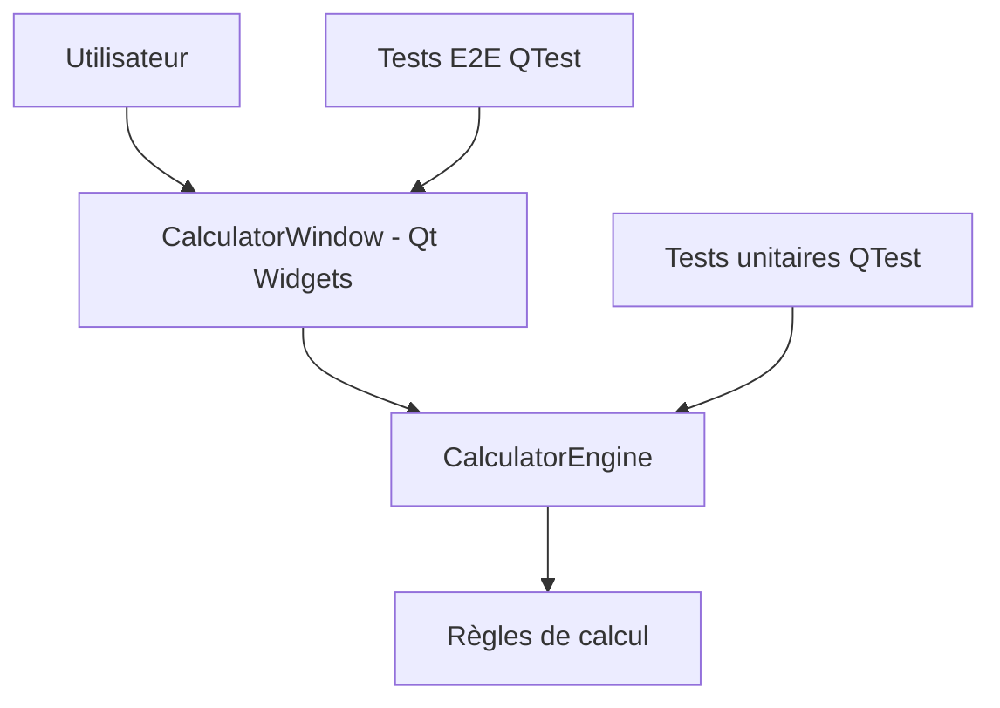

# Calculatrice graphique Qt C++ avec tests E2E QTest

Ce projet montre comment développer une petite application graphique **Qt Widgets** en **C++17** sous Linux et comment la tester avec **QTest**.

L'objectif est pédagogique : séparer le code métier de l'interface, tester la logique métier en tests unitaires, puis piloter l'IHM comme un utilisateur avec des tests end-to-end.

## Contenu du projet

```text
qt-calculator-qtest/
├── CMakeLists.txt
├── src/
│   ├── CalculatorEngine.h
│   ├── CalculatorEngine.cpp
│   ├── CalculatorWindow.h
│   ├── CalculatorWindow.cpp
│   └── main.cpp
├── tests/
│   ├── unit/
│   │   └── CalculatorEngineTest.cpp
│   └── e2e/
│       └── CalculatorWindowE2ETest.cpp
├── scripts/
│   ├── build-linux.sh
│   ├── test-linux.sh
│   └── run-linux.sh
└── .github/workflows/ci.yml
```

## Architecture



La classe `CalculatorEngine` contient la logique métier. Elle ne dépend pas de l'écran.

La classe `CalculatorWindow` construit l'interface Qt, connecte les boutons aux slots et délègue les calculs à `CalculatorEngine`.

Les tests E2E utilisent `QTest::mouseClick` pour cliquer sur les boutons de l'interface.

## Prérequis sous Linux Ubuntu/Debian

### Installation avec Qt 6

```bash
sudo apt update
sudo apt install -y build-essential cmake ninja-build qt6-base-dev qt6-base-dev-tools xvfb
```

### Variante avec Qt 5

Le projet détecte Qt 6 si disponible, sinon Qt 5.

```bash
sudo apt update
sudo apt install -y build-essential cmake ninja-build qtbase5-dev qtbase5-dev-tools xvfb
```

## Compilation

Depuis la racine du projet :

```bash
cmake -S . -B build -DCMAKE_BUILD_TYPE=Debug -DBUILD_TESTING=ON
cmake --build build --parallel
```

Ou avec le script fourni :

```bash
./scripts/build-linux.sh
```

## Exécution de l'application

```bash
./build/qt_calculator
```

Ou :

```bash
./scripts/run-linux.sh
```

## Exécution des tests

```bash
ctest --test-dir build --output-on-failure
```

Pour les tests E2E dans un environnement sans écran, on peut forcer le backend Qt `offscreen` :

```bash
QT_QPA_PLATFORM=offscreen ctest --test-dir build --output-on-failure
```

Ou utiliser Xvfb :

```bash
xvfb-run -a ctest --test-dir build --output-on-failure
```

## Tests unitaires

Fichier :

```text
tests/unit/CalculatorEngineTest.cpp
```

Exemple :

```cpp
void CalculatorEngineTest::addsTwoNumbers() {
    CalculatorEngine engine;
    engine.inputDigit(1);
    engine.inputDigit(2);
    engine.setOperation(CalculatorEngine::Operation::Add);
    engine.inputDigit(3);
    engine.calculateResult();
    QCOMPARE(engine.display(), QString("15"));
}
```

Ce test ne lance pas de fenêtre. Il vérifie uniquement le comportement métier.

## Tests E2E avec QTest

Fichier :

```text
tests/e2e/CalculatorWindowE2ETest.cpp
```

Exemple :

```cpp
void CalculatorWindowE2ETest::userCanAddTwoNumbers() {
    click("button1");
    click("button2");
    click("buttonAdd");
    click("button3");
    click("buttonEqual");

    expectDisplay("15");
}
```

Les tests E2E recherchent les widgets par `objectName` :

```cpp
button->setObjectName("button1");
displayLabel_->setObjectName("displayLabel");
```

Cette pratique est importante : elle rend les tests indépendants du texte visible, de la langue et de la position graphique.

## Boutons disponibles

| Bouton | objectName |
|---|---|
| 0 | `button0` |
| 1 | `button1` |
| 2 | `button2` |
| 3 | `button3` |
| 4 | `button4` |
| 5 | `button5` |
| 6 | `button6` |
| 7 | `button7` |
| 8 | `button8` |
| 9 | `button9` |
| + | `buttonAdd` |
| - | `buttonSubtract` |
| * | `buttonMultiply` |
| / | `buttonDivide` |
| = | `buttonEqual` |
| . | `buttonDecimal` |
| C | `buttonClear` |
| +/- | `buttonSign` |
| % | `buttonPercent` |

## Workflow GitHub Actions

Le workflow `.github/workflows/ci.yml` :

1. installe les dépendances système Qt ;
2. configure CMake ;
3. compile le projet ;
4. exécute les tests avec `xvfb-run`.

Extrait :

```yaml
- name: Run tests with CTest and Xvfb
  run: xvfb-run -a ctest --test-dir build --output-on-failure
```

`Xvfb` fournit un serveur X virtuel. C'est utile pour tester une application graphique dans un runner GitHub Actions sans écran physique.

## Points pédagogiques importants

### Pourquoi séparer `CalculatorEngine` et `CalculatorWindow` ?

Parce qu'une interface graphique est plus coûteuse à tester qu'une classe métier. La séparation permet :

- des tests unitaires rapides ;
- des tests E2E ciblés ;
- une meilleure maintenabilité ;
- une logique métier réutilisable indépendamment de Qt Widgets.

### Pourquoi utiliser `objectName` ?

Dans les tests d'interface, il faut des sélecteurs stables. Le texte d'un bouton peut changer avec une traduction ou une décision UX. L'`objectName` reste un identifiant technique stable.

### Quelle différence entre test unitaire et test E2E ?

| Type de test | Cible | Exemple |
|---|---|---|
| Test unitaire | `CalculatorEngine` | `12 + 3 = 15` |
| Test E2E | `CalculatorWindow` | clics utilisateur sur `1`, `2`, `+`, `3`, `=` |

## Commandes récapitulatives

```bash
sudo apt update
sudo apt install -y build-essential cmake ninja-build qt6-base-dev qt6-base-dev-tools xvfb

cmake -S . -B build -DCMAKE_BUILD_TYPE=Debug -DBUILD_TESTING=ON
cmake --build build --parallel
ctest --test-dir build --output-on-failure
./build/qt_calculator
```

En CI headless :

```bash
xvfb-run -a ctest --test-dir build --output-on-failure
```
